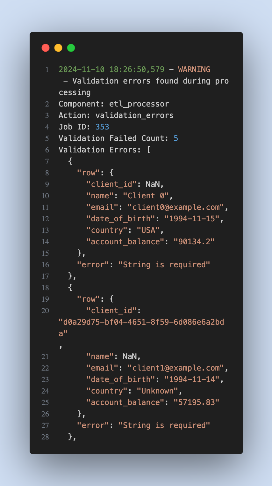
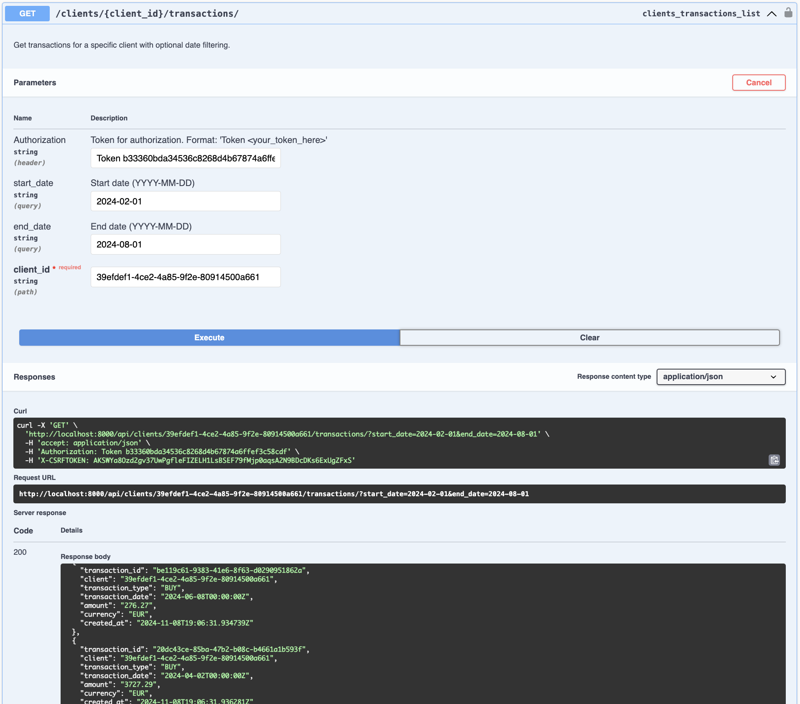

# Neo Challenge - Data Engineering Project

## Quick Start 🚀
---

<div align="center">

[](https://www.python.org/)
[](https://www.djangoproject.com/)
[](https://www.postgresql.org/)
[](https://redis.io/)
[](https://www.docker.com/)

<!-- Project Features -->
[](docs/rate-limiting.md)
[](docs/db-partitioning.md)
[](docs/logging.md)
[](/admin)
[](/swagger)

<!-- Quality & Standards -->
[](coverage)
[](https://github.com/psf/black)
[](https://opensource.org/licenses/MIT)


</div>

### 1. Clone and Setup
Clone repository
```bash
git clone https://github.com/TalalBadreddine/neo_tech_challange
cd neo_challenge
```
Copy environment file
```bash
cp .env.example .env
```
### 2. Start with Docker
Build and start containers
```bash
docker-compose up --build
```

### 3. Run etl process
```bash
docker-compose exec web python manage.py run_etl \
    --clients-file=data/clients.csv \
    --transactions-file=data/transactions.xlsx
    --verbose
```

### 4. Monitor ETL Jobs
- Visit http://localhost:8000/admin/core/etljob/
- Login with admin credentials:
  - Username: admin
  - Password: adminpass123
- View all ETL jobs and their status

### 5. API
- The application will be running at:
- Admin Dashboard: http://localhost:8000/admin/
- API Documentation: http://localhost:8000/swagger/
- API: http://localhost:8000/api/


## 🔍 Technical Details

### 🚦 Rate Limiting
- **Limit**: 10 requests per minute
- **Implementation**: Redis-based rate limiting
- **Scope**: Applied to specific endpoints:
  - `/api/clients/` (GET)
  - `/api/clients/{client_id}/transactions` (GET)

### 💾 Database Architecture
#### Transaction Partitioning Strategy
- **Method**: Date-based partitioning
- **Interval**: 5-year segments
- **Benefits**:
  - Improved query performance
  - Efficient data management
  - Better backup granularity

### 🧪 Test Coverage
- **Current Coverage**: 95%
- **Run Tests**:
  ```bash
  coverage run manage.py test
  ```
- **View Reports**:
  ```bash
  coverage report    # Terminal output
  coverage html     # Detailed HTML report
  ```

  <div>
      
      <p>Test coverage report</p>
  </div>

### 🎛️ Monitoring & Administration
- **Django Admin Dashboard** (/admin)
  - ETL process monitoring
  - Materialized view refresh status
  - System health metrics
  - User activity logs

  <div>
      
      <p>ETL Job</p>
  </div>
  <div>
      
      <p>View Results</p>
  </div>
  <div>
      
      <p>Materialized View</p>
  </div>

### logging
- The logging is being saved in a file in the `logs/` directory, you can check it to see the details of the process

<div>
    
    <p>Logs for etl validation warnings</p>
</div>

<div>
    
    <p>Logs for etl info</p>
</div>

<div>
    
    <p>Logs for errors</p>
</div>

### 📚 API Documentation
- **Swagger UI**: `/swagger`
- **OpenAPI Spec**: `/swagger.json`
<div>
    
    <p>Swagger UI</p>
</div>

## ETL Process 🔄

### 1. Prepare Data Files
Place your data files in the `data/` directory:
- clients.csv
- transactions.csv

### 2. Run ETL Process
The ETL process can be run in two modes: Bulk Processing (default) and in case of failure, the failed batch will be processed in Single-Row Processing.

Flags:
- --verbose: to show more logs related to the validation process, celery tasks, etc. (default: False)

PS: the etl proccess is being logged in logs file, you can check it in `logs/`

### 3. Monitor ETL Jobs
1. Via Admin Dashboard:
   - Visit http://localhost:8000/admin/core/etljob/
   - Login with admin credentials
   - View all ETL jobs and their status

2. Via API:
```bash
List all jobs
```bash
curl http://localhost:8000/admin/core/etljob/
```
```bash
Check specific job
curl http://localhost:8000/admin/core/etljob/<job_id>/
```


## API Authentication 🔑

### 1. Create User
1. Open Swagger UI: http://localhost:8000/swagger/
2. Navigate to "Users" section
3. Find POST `/api/auth/register` endpoint
4. Click "Try it out"
5. Input user data in the request body:
```json
{
  "username": "user",
  "password": "12345678"
}
```
6. Click "Execute"
7. You should receive a 201 Created response

### 2. Get Authentication Token
1. In Swagger UI, find POST `/api/auth/login/`
2. Click "Try it out"
3. Input credentials:
```json
{
  "username": "user",
  "password": "12345678"
}
```
4. Click "Execute"
5. Copy the `token` from the response:
```json
{
  "token": "eyJ0eXAiOiJKV1QiLCJhbGc...",
  "user": {
    "username": "user"
  }
}
```
### 3. Use Token in API Requests
1. For any authenticated endpoint in Swagger UI
2. Click "Try it out"
3. In the "Authorization" section:
   - Add Value: `Token <your-access-token>`
   - Example: `Token eyJ0eXAiOiJKV1QiLCJhbGc...`
4. Click "Execute"

### 4. Test Authorization
1. Try GET `/api/clients/<client_id>/transactions/`
2. Add in the Authorization section: `Token <your-access-token>`
3. Add in the client_id in the path params: `412ebc1-f3e2-400b-a1c3-51860cb45c5d`
4. You can add other params to filter the transactions:
- start_date: `2023-01-01`
- end_date: `2024-12-31`

## Troubleshooting 🔧

### ETL Issues

Check file permissions
```bash
docker-compose exec web ls -l /app/data/
```

View ETL job logs
```bash
docker-compose exec web python manage.py shell
>>> from core.models import ETLJob
>>> ETLJob.objects.latest('created_at').error_message
```


## Need Help? 🤔
- Check the logs: `docker-compose logs`
- Visit the admin dashboard
- Review API documentation at `/swagger/`
- Open an issue on GitHub: [Neo Challenge](https://github.com/TalalBadreddine/neo_tech_challange/issues)